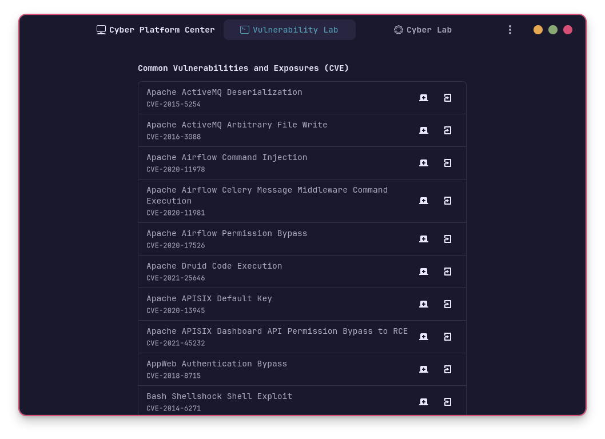

<div align="center">
    <!---->
    <h1>Athena OS Cyber Hub</h1>
    <p>Athena Cyber Hub is a forked version of <a href="https://github.com/Vanilla-OS/vanilla-control-center">Vanilla Control Center</a> with several differences in order to fit the needs of Cyber Security users on <a href="https://github.com/Athena-OS">Athena OS</a>.</p>
    <p>Unlike <a href="https://github.com/Vanilla-OS">Vanilla OS</a>, it replaces distrobox by docker and it is not intended to run operating systems or managing the updates, but it is intended to run vulnerable laboratories for learning purposes and cyber security platforms for offensive and defensive activities.</p>
    <hr />
</a>
    <br />
    
</div>

## Usage
**Athena OS Cyber Hub (ACH)** provides three sections:
* Cyber Platforms
* Vulnerable Labs
* Cyber Labs

#### Cyber Platforms
It offers a set of **Cyber Security platforms** used for several purposes (i.e., defensive), as [DefectDojo](https://github.com/DefectDojo/django-DefectDojo) and [GreenBone](https://github.com/greenbone/) tools.

#### Vulnerable Labs
It contains several **CVE laboratories** from [Vulhub](https://github.com/vulhub/vulhub) where you can train on **real CVEs** to exploit technologies and services. Run your favourite vulnerable environment and get your CVE!

#### Cyber Labs
Set your **custom containers** and manage them in a centralized manner! When ACH is run for the first time, it will create `~/.config/athena-cyber-hub/cyberlab.toml` configuration file. Edit it by inserting the required information about your container, and then run ACH. Your containers will be collected in Cyber Labs section.

Example configuration file:
```toml
[[environment]]
id = "vulhub/activemq"
name = "ActiveHello"
path_docker = "/usr/share/athena-platform-center/vulhub/activemq/CVE-2015-5254/docker-compose.yml"
path_readme = "/usr/share/athena-platform-center/vulhub/activemq/CVE-2015-5254/README.md"

[[environment]]
id = "well-hub/yourlab"
name = "Container 2"
path_docker = "/path/to/docker-compose.yml"
path_readme = "/path/to/README.md"
```

## Build from source
### Dependencies
- base-devel
- meson
- go
- appstream-glib
- libadwaita
- gettext
- desktop-file-utils
- python-lxml
- python-toml
- vte4
- docker
- docker-compose
- gnome-console
- marktext

### Build
```bash
meson setup build
ninja -C build
```

### Install
```bash
sudo ninja -C build install
```

## Run
```bash
athena-cyber-hub
```

## Credits
Athena Cyber Hub is a forked project of [Vanilla Control Center](https://github.com/Vanilla-OS/vanilla-control-center) adapted for [Athena OS](https://github.com/Athena-OS). I would like to thank [@mirkobrombin](https://github.com/mirkobrombin) and [Vanilla OS team](https://github.com/orgs/Vanilla-OS/people) for the original project.
